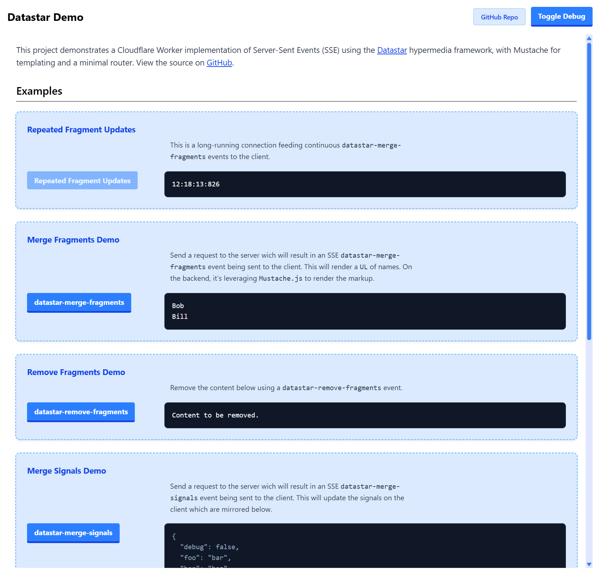

# Cloudflare Worker: SSE, Datastar and Mustache.

This repository an implementation of Datastar driven by a Cloudflare static asset worker sending Server Sent Events.  It leverages a bare-bones router and Mustache for template rendering (if necessary).

> **Note:** This project is currently experimental and serves as a Proof of Concept (POC). It may not be suitable for production use and is subject to change. Use it at your own risk.

### Demo Frontend

The project includes a demo frontend that showcases some features of the SSE implementation. The demo provides interactive examples.

You can run the demo locally by following the development instructions below.



## Dependencies

### Core Libraries
- `@tsndr/cloudflare-worker-router`: Lightweight router for Cloudflare Workers with TypeScript support
- `@janl/mustache.js`: Logic-less templating engine for rendering HTML templates
- `@cloudflare/workers-types`: TypeScript definitions for Cloudflare Workers

### Custom Utilities

#### Datastar Specific [SSE Events Documentation](https://data-star.dev/reference/sse_events)
- `mergeFragments`: Merges one or more fragments into the DOM.
- `mergeSignals`: Updates the signals with new values.
- `removeFragments`: Removes one or more HTML fragments that match the provided selector from the DOM.
- `removeSignals`: Removes signals that match one or more provided paths.
- `executeScript`: Executes JavaScript in the browser.

#### Wokrer / SSE Specific
- `repeatingEvent`: Helper for creating repeating SSE events
- `createSSEResponse`: Utility for creating Server-Sent Events responses

## Datastar Event Types

The worker supports all (as of this writing) Datastar server sent event types.  These include:

### Merge Fragments
```
event: datastar-merge-fragments
data: fragments <minified-html>
data: selector <css-selector>
data: mergeMode <mode>
data: useViewTransition <boolean>
```

### Merge Signals
```
event: datastar-merge-signals
data: signals <json-string>
data: onlyIfMissing <boolean>
```

### Remove Fragments
```
event: datastar-remove-fragments
data: selector <css-selector>
```

### Remove Signals
```
event: datastar-remove-signals
data: paths <path1>
data: paths <path2>
```

### Execute Script
```
event: datastar-execute-script
data: autoRemove <boolean>
data: attributes <name> <value>
data: script <javascript-code>
```

## Implementation Details

### HTML Minification
All HTML fragments pushed through the `mergeFragments` event type are automatically minified before being sent to the client. The minification process attempts to:
- Remove unnecessary whitespace
- Preserve essential whitespace in text content
- Maintain HTML structure and functionality

### Custom Event Types
While we provide factory functions for common event types, you can create custom events by implementing the `Event` interface:

```typescript
interface Event {
  type: string;
  format(): string;
  _repeating?: {
    frequency: number;
    originalEvent: Event | null;
  };
}
```

The `/heartbeat` endpoint demonstrates this with a custom event that:
- Uses `type: null` for a comment event
- Implements a custom `format()` method
- Includes repeating functionality

## Available Datastar Example Endpoints

### /merge-fragments
Updates HTML content with static content.
```typescript
const event = mergeFragments({
  fragment: '<div>Static content</div>',
  selector: '#listing'
});
```

#### Fragment Types

The `fragment` property in `mergeFragments` can be either:
- A string: For static content that doesn't change (evaluated once when the event is created)
- A function: For dynamic content that needs to be re-evaluated (called each time the event is sent)

```typescript
// Static content - evaluated once
fragment: '<div>Static content</div>'

// Dynamic content - re-evaluated each time
fragment: () => `<div>${new Date().toLocaleTimeString()}</div>`
```

Important notes about dynamic fragments:
1. The function is called each time the event is sent
2. Use for content that needs to be fresh (clocks, counters, real-time data)
3. Can be combined with repeating events for periodic updates
4. The function should be pure and fast, as it may be called frequently

### /merge-fragments-repeating
Updates HTML content with dynamic content that changes every second.
```typescript
const event = mergeFragments({
  fragment: () => `<div id="clock">${new Date().toLocaleTimeString()}</div>`,
  selector: '#clock'
});
const repeatEvent = repeatingEvent(event, 1000);
```

### /merge-signals
Updates client-side state.
```typescript
const event = mergeSignals({
  signals: {
    foo: 'merged'
  }
});
```

### /remove-fragments
Removes HTML elements from the DOM.
```typescript
const removeEvent = removeFragments({
  selector: '#listing'
});
```

### /remove-signals
Removes signals from client-side state.
```typescript
const removeEvent = removeSignals({
  paths: ['foo', 'nested.baz']
});
```

### /execute-script
Executes JavaScript code on the client side.
```typescript
const executeEvent = executeScript({
  autoRemove: true,
  attributes: [
    { name: 'type', value: 'module' },
    { name: 'defer', value: true }
  ],
  scripts: [
    'console.log("Hello, world!")',
    'console.log("Here is a second console line to output!")'
  ]
});
```

### /heartbeat
Sends a timestamp every second to keep the connection alive. This is an example of an ad-hoc Event type that doesn't use our standard event factories. It's particularly useful in the Cloudflare Workers environment where connections might be closed due to:
- CPU usage limits
- Connection timeouts
- Worker instance recycling

The heartbeat ensures the connection stays alive and provides a way to detect connection issues on the client side.

```typescript
const timestampEvent = {
  type: null,
  format() {
    return `: ${new Date().toLocaleTimeString()}\n\n`;
  },
  _repeating: {
    frequency: 1000,
    originalEvent: null
  }
};
```

## Development

```bash
# Install dependencies
npm install

# Run locally
npm run dev

# Visit Demo Frontend @ http://localhost:8787/

# Run tests
npm test

# Run tests in watch mode
npm run test:watch

# Run tests with coverage
npm run test:coverage

# Deploy to Cloudflare
npm run deploy
```